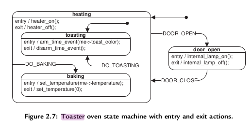

# Active Object Pattern

- This repository implements (or at least tries to) the active object pattern in C++ as is described in the book "Practical UML Statecharts in C/C++: Event-Driven Programming for Embedded Systems - Miro Samek".

- The example implemented is the Toaster example, presented in Chapter 2


- In this pattern, Active Objects (Actors) are event-driven, strictly encapsulated software objects running in their own threads of control that communicate with one another asynchronously by exchanging events.


## How to operate the repository
- To format the code base with clang-format:
```bash
./bbuild.sh -f
```

- To build:
```bash
./bbuild.sh -b <target>
```

- To rebuild:
```bash
./bbuild.sh -r <target>
```

- To execute the built binary:
```bash
./bbuild.sh -e <target>
```

- To format, rebuild and execute with verbose:
```bash
./bbuild.sh -v -f -r -e <target>
```
  - Example: `./bbuild.sh -v -f -r -e app`
  - Example: `./bbuild.sh -v -f -r -e test`

- To check all options available::
```bash
./bbuild.sh --help
```